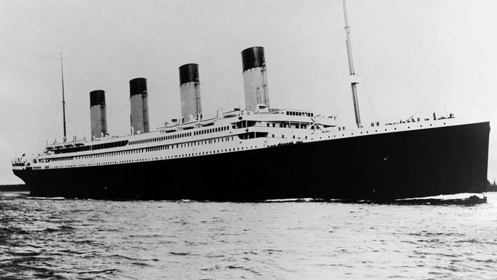

# Titanic - Machine Learning from Disaster
## Predicting survivors of the Titanic shipwreck

    

# 1. Context

The sinking of the Titanic is one of the most infamous shipwrecks in history. On April 15, 1912, during her maiden voyage, the widely considered “unsinkable” RMS Titanic sank after colliding with an iceberg. Unfortunately, there weren’t enough lifeboats for everyone onboard, resulting in the death of 1502 out of 2224 passengers and crew. While there was some element of luck involved in surviving, it seems some groups of people were more likely to survive than others.

In this challenge, we want to build a model that predicts which passengers survived the Titanic shipwreck, using data (ie name, age, gender, socio-economic class, etc).

# 2. Solution Strategy

To solve the problem, we will follow these step:

- **0.0.** Data Collection.
- **1.0.** Data description.
- **2.0.** Feature Engineering
- **3.0.** Filtering the features
- **4.0.** Exploratory Data Analysis
- **5.0.** Data preparation
- **6.0.** Feature selection
- **7.0.** Machine Learning Modelling
- **8.0.** Hyperparameter fine tuning
- **9.0.** Machine Learning Performance
- **10.0.** Conclusions

# 3. Top 3 Data Insights

**Hypothesis 01**: Passengers accompanied by parents or children survive, on average, less than unaccompanied passengers.

**False**. Passengers accompanied by parents or children survive, on average, more than unaccompanied passengers.

**Hypothesis 02**: Passengers accompanied by siblings or spouses survive, on average, less than unaccompanied passengers.

**False**. Passengers accompanied by siblings or spouses survive, on average, more than unaccompanied passengers.

**Hypothesis 03**: Passengers who boarded the port of southampton, on average, survived more than passengers who boarded at other port.

**False**. Passengers who boarded the port of southampton, on average, survived less than passengers who boarded at other port.

# 4. Machine Learning Model Aplied

Tests were made using different algorithms.

- Random Forest Classifier
- Logistic Regression
- Naive Bayes
- K-Nearest Neighbors Classifier

The KNN model achieved the best performance, with an accuracy of approximately 80%.

# 5. Machine Learning Model Performance

The chosen algorithm was the K-Nearest Neighbors. The metrics used were: **Accuracy, Precision, Recall and F1-score**.

These are the metrics obtained from the test set.

| Accuracy | Precision | Recall | F1-score |
|----------|-----------|--------|----------|
| 0.80     | 0.82      | 0.62   | 0.71     |

# 6. Conclusions

Finally, we saw that the model that achieved the best performance was the K-Nearest Neighbors. This project was of great value to apply practices and knowledge that data scientists must have to solve more complex problems. For future work, we should consider other classification models, other performance metrics and try to create features that contribute to improving the performance of the result.

# 7. Lessons Learned

With the development of this small project, I was able to learn the basics of almost every step of data science projects. From data collection, preparation and modeling, to the creation of machine learning models and performance evaluation. I'm sure the lessons learned here will be of great value for solving more complex problems in the future.

# 8. Next Steps

**1. Create features that will help improve model performance**.

**2. Deploy model to production**.

